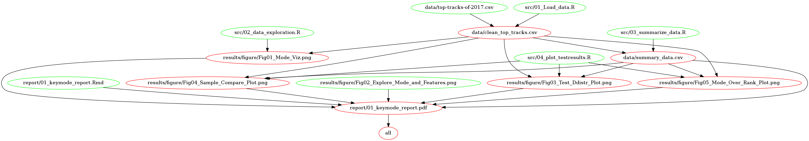

# Song Key Mode & Popularity

**Team Members**<br>
[Paul Vial](https://github.com/Pall-v) <br>
[Socorro Dominguez](https://github.com/sedv8808)<br>

## Spotify Analysis Proposal

In music, "keys" are sets of notes which sound harmonious together.  One of the most distinguishing features of a musical key is its "mode" which we can categorize as "major" or "minor."  These two modes affect the mood of music similarly to how certain beats may make songs more "likeable." Music written in a major key mode usually sounds happy, while music written in a minor key mode usually sounds sad or serious.  We are interested in whether these modes (major vs. minor) of songs' keys affect their popularity.

Spotify is a music streaming platform. They have become an important platform as they currently have 191 million users. 87 million of these users, pay in order to be premium users. Their Top 100 is defined by the songs that are streamed the most throught a year. 

Through this evaluation, we went through a data set from Spotify to analyze whether people are actively listening to more songs that are in major key modes or minor key modes.

## Usage

### Docker

To run this analysis using Docker:

1. Clone/download this repository
2. Use the command line on your computer to get the [song_key_mode_and_popularity_on_spotify](https://hub.docker.com/r/pvial/song_key_mode_and_popularity_on_spotify/) image from [DockerHub](https://hub.docker.com/): 
```
docker pull pvial/song_key_mode_and_popularity_on_spotify
```
3. Use the command line to navigate to the root of this project on your computer, and then type the following (filling in *\<Path_on_your_computer\>* with the absolute path to the root of this project on your computer).
```
docker run --rm -e PASSWORD="test" -v <Path_on_your_computer>:/home/rstudio/Song_Key_Mode_and_Popularity_on_Spotify  pvial/song_key_mode_and_popularity_on_spotify make -C '/home/rstudio/Song_Key_Mode_and_Popularity_on_Spotify' all
```

4. To clean up the analysis type:
```
docker run --rm -e PASSWORD="test" -v <Path_on_your_computer>:/home/rstudio/Song_Key_Mode_and_Popularity_on_Spotify  pvial/song_key_mode_and_popularity_on_spotify make -C '/home/rstudio/Song_Key_Mode_and_Popularity_on_Spotify' clean
```

### Without Docker

This repository consists of 4 R scripts and 1 Rmd file.
<br>
Use this `Makefile` to generate the report analysing if the feature `mode` makes a difference in a Spotify song to rank in the Top 100. 
<br>

In order to run this project, you need to: 
1. Clone or download this repository.

2. Run the following code in the terminal at the project's root repository.
To run the scripts: 

```
# From the command line.

# To run all the R scripts from beginning to the end. Delivers a final report.
make all

#	Deletes all unnecessary files in case you need to run the project from scratch.
make clean

```
The makefile is the short way of running all R scripts in the following order :

```
# Load data
Rscript src/01_Load_data.R data/top-tracks-of-2017.csv data/clean_top_tracks.csv

# Exploratory Data Analysis
Rscript src/02_data_exploration.R data/clean_top_tracks.csv ./results/figure/Fig01_Mode_Viz.png ./results/figure/Fig02_Explore_Mode_and_Features.png

# Summarize data
Rscript src/03_summarize_data.R ./data/clean_top_tracks.csv ./data/summary_data.csv

# Visualize data analysis
Rscript src/04_plot_testresults.R ./data/clean_top_tracks.csv ./data/summary_data.csv ./results/figure/Fig03_Test_Ddistr_Plot.png ./results/figure/Fig04_Sample_Compare_Plot.png ./results/figure/Fig05_Mode_Over_Rank_Plot.png

# write the report
Rscript -e "rmarkdown::render('report/01_keymode_report.Rmd')"
```

## What We Did

We downloaded the data from Top Spotify Tracks of 2017 (top-tracks-of-2017.csv) and Spotify's Worldwide Daily Song Ranking (data.csv). Then, we investigated if the key-mode of a song is related to its ranking in the top 100. 

We implemented "estimation through simulation" and wrote an inferential analysis. After doing our test, we did not manage to reject the null hypothesis.

The final report consists of:

Hypothesis <br>
Estimation Through Simulation Statistical Summary <br>
Critics, Limitations, and Assumptions on Analysis <br>
References

## Data

**1) Dataset:** Top Spotify Tracks of 2017 (top-tracks-of-2017.csv) and Spotify's Worldwide Daily Song Ranking (data.csv)

Link to the data sets: We loaded the dataset using tidyverse in R. 

https://www.kaggle.com/nadintamer/top-tracks-of-2017

** Data Attributes We Are Working With**
*Source: [Spotify Top 100 Tracks](https://developer.spotify.com/documentation/web-api/reference/tracks/get-audio-features/)

* id - Spotify URI of the song
* name - Name of the song
* danceability - describes how suitable a track is for dancing. A value of 0.0 is least danceable and 1.0 is most danceable.
* energy - is a measure from 0.0 to 1.0 and represents a perceptual measure of intensity and activity. 
* key - key the track is in. Integers map to pitches using standard Pitch Class notation.
* loudness - The overall loudness of a track in decibels (dB)
* mode - indicates the modality (major or minor) of a track, the type of scale from which its melodic content is derived. Major is represented by 1 and minor is 0.
* speechiness - detects the presence of spoken words in a track. The more exclusively speech-like the recording, the closer to 1.0 the attribute value.
* instrumentalness - Predicts whether a track contains no vocals. 
* liveness - Detects the presence of an audience in the recording. 
* valence - A measure from 0.0 to 1.0 describing the musical positiveness conveyed by a track. 
* tempo - The overall estimated tempo of a track in beats per minute (BPM). 
* duration_ms - The duration of the track in milliseconds.
* time_signature - An estimated overall time signature of a track. 

## Procedure

We reviewed the datasets we had.  Originally, we thought it would be necessary to work with another data set to complement our information. With the other data set, we could get the exact number of streams per song. The one that we did use, The Top Tracks data set, ranks the songs according to the number of streams, however, does not give out the number of streams that the ranking is based on. Hence, we decided to work using only the "rank number."

Check outliers

Plot a graph to see which key-mode appeared more frequently in our data set. 

State hypotheses:

  Null Hypothesis: Songs in a major key-mode have an equal average Spotify ranking to songs in a minor key-mode.

  Alternative Hypothesis: Songs in a major key-mode have different average Spotify ranking than songs in a minor key-mode.
  
Determine the level of significance.

We used "Estimation through simulation" to determine whether songs may rank differently based on their key-modes.

We then did a bootstrap distribution and reported a p-value and where our statistic was stood relative to our confidence interval.

We wrote four scripts for this project and a report. The scripts are to clean our data, explore our data, estimate through simulation and visualize our results. 

## OUR CONCLUSION:

- After evaluating our dataset, and done the statistical analysis, we realized that we cannot reject our Null Hypothesis. That means, there is not enough evidence to say that `mode` alone plays a role in making a song `likable`. 

- We have to take into consideration that our dataset is the top 100 songs which creates a sampling bias.  

- This analysis is very limited due to time constraints. We are only considering one feature of the songs. If we were given more time, we would like to look at what role the other features play and how important the interaction between these features is. 

-How to improve this analysis: We would use another in-depth algorithm. Possible, we would look at a `Decision Tree`. 
This way, we could consider all other song features. 

- It was fun to play with a real world data set and learn how to make questions about the data that we have in our hands. We also enjoyed the process of understanding how important `reproducibility` is and how to create `docker images` so that other people can reproduce our analysis and give us inputs on how to improve. 

- We also enjoyed seeing how we can apply some of the tools we have so far learned in MDS. 


## Dependencies

RStudio version 3.5.1

[float](https://ctan.org/pkg/float)

[tidyverse](https://github.com/tidyverse)

[readr](https://github.com/tidyverse/readr)

[ggplot2](https://github.com/tidyverse/ggplot2)

[dplyr](https://github.com/tidyverse/dpylr)

[gridExtra](https://github.com/cran/gridExtra)

[infer](https://github.com/tidymodels/infer)

[tinytex](https://github.com/yihui/tinytex)



## Release version

[V4.1](https://github.com/UBC-MDS/Song_Key_Mode_and_Popularity_on_Spotify/releases/tag/V4.1) Final Project<br>
[V3.1](https://github.com/UBC-MDS/Song_Key_Mode_and_Popularity_on_Spotify/releases/tag/V3.1) Milestone 2<br>
[V2.1](https://github.com/UBC-MDS/Song_Key_Mode_and_Popularity_on_Spotify/releases/tag/V2.1) We are doing this release to adjust the Readme to the TA's expectations for Milestone 1.<br>
[V2.0](https://github.com/UBC-MDS/Song_Key_Mode_and_Popularity_on_Spotify/releases/tag/v2.0) Milestone 1<br>
[V0.1](https://github.com/UBC-MDS/Song_Key_Mode_and_Popularity_on_Spotify/releases/tag/0.1) Proposal
