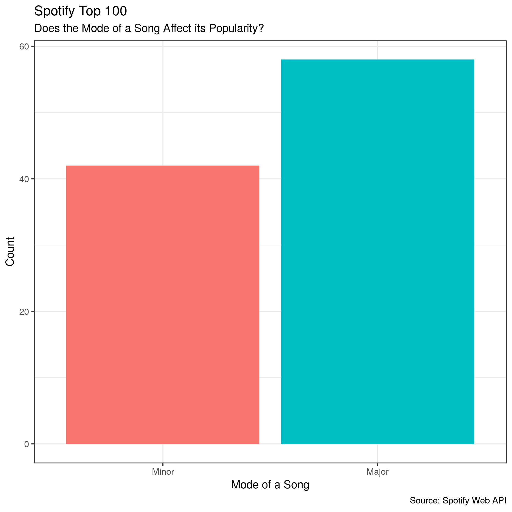
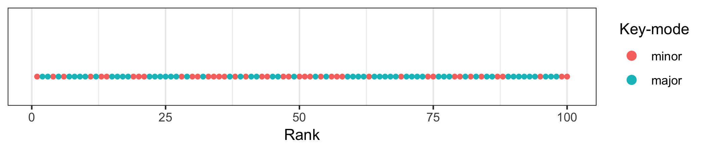
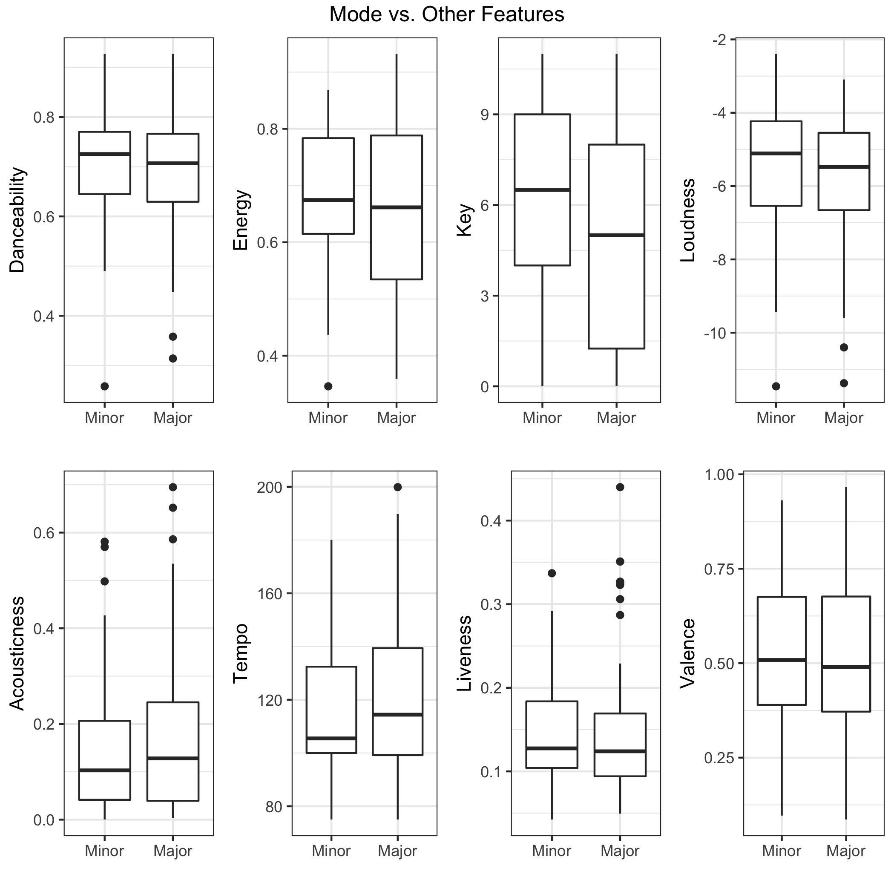
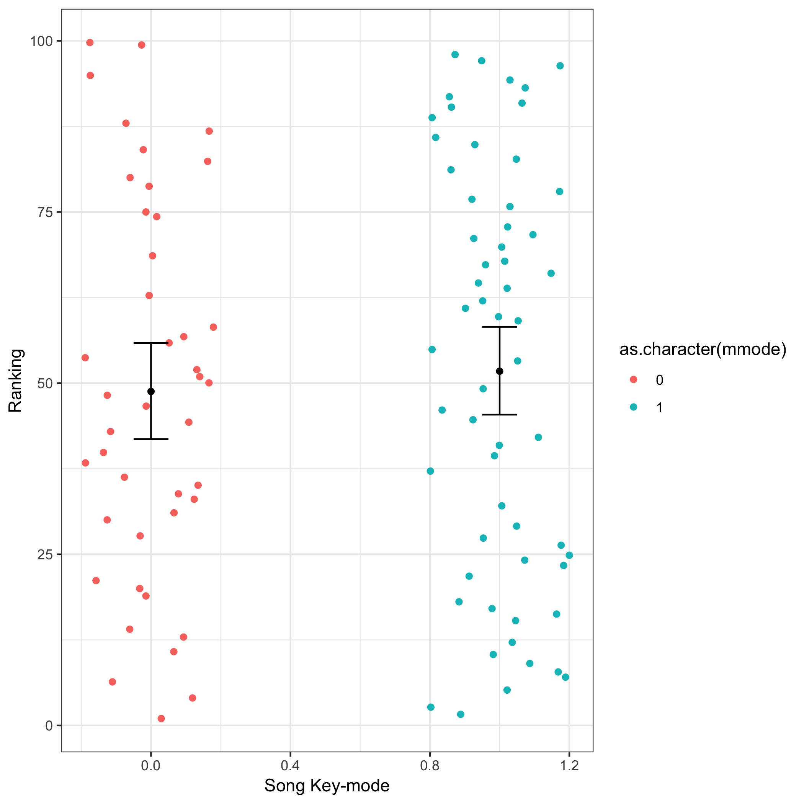
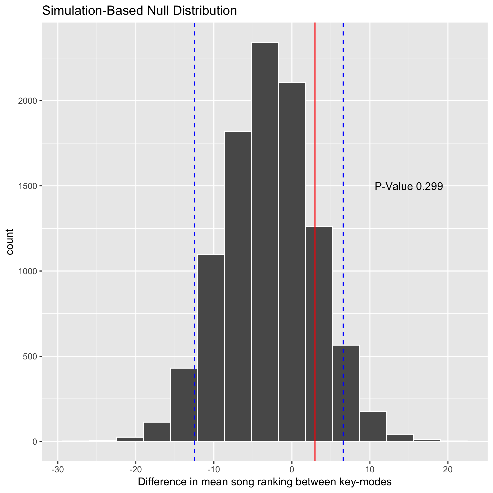

```{r setup, include=FALSE}
knitr::opts_chunk$set(echo = FALSE, fig.width = 2)
```

Is the popularity of songs in a major key different than songs in a minor key? (Are they more likely to be in the Top 100?) This is the question we will try to answer by looking at and analyzing Spotify's Top 100 streamed songs! 

First of all, in music, "keys" are sets of notes which sound harmonious together. One of the most distinguishing features of a musical key is its "mode" which we can categorize as "major" or "minor." These two modes affect the mood of music similarly to how certain beats may make songs more "likeable." Music written in a major key-mode usually sounds happy, while music written in a minor key-mode usually sounds sad or serious. We are interested in whether these modes (major vs. minor) of songs' keys affect their popularity.

Spotify is a music streaming platform. They have become an important platform as they currently have 191 million users. 87 million of these users, pay in order to be premium users. Their Top 100 is defined by the songs that are streamed the most throught a year. 

Through this evaluation, we go through Spotify's Top 100 2017 data set to analyze whether people are actively listening to more songs that are in major key-modes or minor key-modes. 

Once we load the data, we make a small summary to see actually how many songs in Spotify have a minor or a major mode. <br>

Table01: Summary of how many songs have a major or minor mode


| Mode | Avg Rank | Count | Diff. Est. |
|---|---|---|---|
|Minor | 48.78 | 42 | 2.9556 |
|Major | 51.74  | 58 | 2.9556 |

<br>

Figure 1{ width=70% }


We can read from this graph, that at least for the 2017's Top 100, songs in a major key-mode (or happier sound) were more popular than songs in a minor key-mode (or sad/serious sound). However, this might just be by chance. 

```{r Key-mode distribution over rank, fig.width = 2}

```

Out of curiousity, let's also evaluate how other features (danceability, key, loudness, etc) in the song vary with by songs' key-modes:

Figure 2{ width=80% }
<br>

We understand, that by just working with this key-mode (rather than the combination of features) is a limitation of our work. And if given more time, we would love to explore all the features to see what makes a song really popular. 

Now, using 'Estimation through simulation,' we are going to test if the key-mode actually plays a role in the songs' rankings.

Our hypotheses are as follows:

\textbf{$H_{0}$}: Songs in a major key-mode have an equal average Spotify ranking to songs in a minor key-mode.

\textbf{$H_{A}$}: Songs in a major key-mode have different average Spotify ranking than songs in a minor key-mode.

Our test statistic is the difference between songs in a major key-mode and songs in a minor key-mode.

{ width=80% }

Figure 3 - Error bars represent 95% confidence intervals generated by bootstrapping


In the Figure 3 above, we can see that there is significant overlap between the confidence intervals for the two groups.

Figure 4 below illustrates where our p-value falls relative to the confidence interval for our test statistic:

{ width=80%}

Figure 4 - Error bar represents 95% confidence intervals generated by boostrapping

# RESULTS: 

- Our p-value is \textbf{$0.299$}.  As our p-value is larger than the alpha (\textbf{$0.1$}), we do not reject the null hypothesis. 

Our dataset is the top 100 songs which creates a sampling bias.  Ideally, we would be able to compare the proportions of songs in each key-mode from the top 100 to the proportions of songs in each key-mode from a random sample of Spotify songs.

This analysis is very limited due to time constraints, and we are only taking into consideration one feature of the songs. We would like to analyze all the features and their combinations to see how this affects a song's popularity. 

Given more time in the future, we would like to try a more in-depth analysis and maybe try using a Decision Tree to consider all other song features besides key-mode. 

## REFERENCES

Top Spotify Tracks of 2017, Audio features of top Spotify songs - Retrieved from: https://www.kaggle.com/nadintamer/top-tracks-of-2017

Wikipedia Major and Minor - Retrieved from: https://en.wikipedia.org/wiki/Major_and_minor

UBC MDS Statistical Inference Lecture 04 - Retrieved from: https://github.ubc.ca/MDS-2018-19/DSCI_552_stat-inf-1_students/blob/master/lectures/04_lecture-sim-estimation-wrap-up-and-hyp-test-intro.ipynb

Wikipedia Spotify - Retriefed from: https://en.wikipedia.org/wiki/Spotify